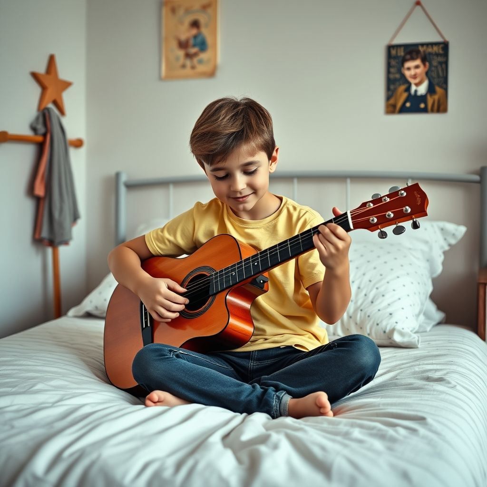
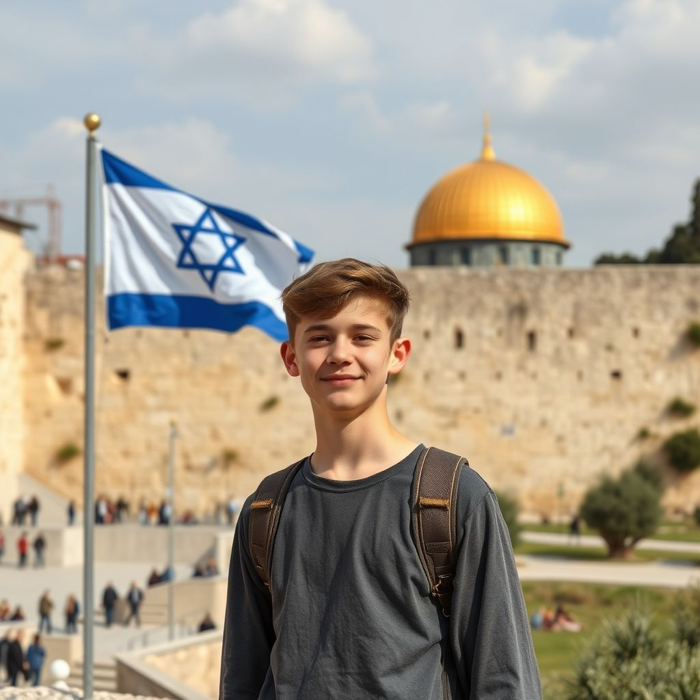

Hello, Bonjour and Shalom!

My name is Emmanuel. Welcome to my website.

Enjoy this brief summary of my life, told by AI generated images. 

---
On a bright summer's day I was born in the city of Montreal, Canada. This child however had a mind of his own...

---

As a child, I was amazed by animals and the human body. Looking at picture books about nature planted the seeds that made me go into biology later in life...

---

At the age of 12, I discovered music and started a lifelong passion for playing the guitar...

---

At 15, I travelled to Israel for the first time. When I came back home, my parents didn't believe me when I told them I would move there someday...

---

Then one day, I got accepeted for graduate studies at the WIS and two dreams came true at once...

---

And the rest of the story, only time will tell.

##Windows
[hello](./hello.md)
